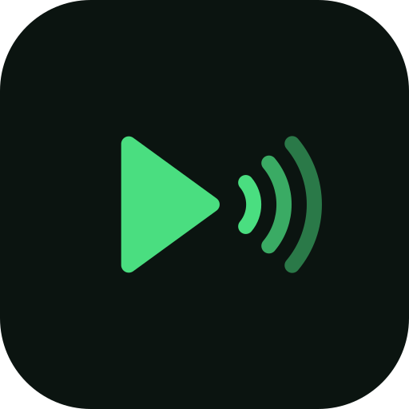

<p align="center"></p>

# letsgo

Play your music on every device on your Wi-Fi, in sync. Phones, laptops, anything
that can run it. No internet, no cloud, no accounts.

There is no server to set up. **Every device runs the same app.** Whichever device
is playing is the source; every other device on the network hears it, in sync, and
shows what is playing. Press play on the other phone and the sound *shifts* to it: the
first one pauses and follows.

```
   phone A (playing)                       laptop            phone B
 ┌────────────────────┐   synced audio   ┌────────────┐    ┌────────────┐
 │ your music files   │ ───────────────► │ speakers   │    │ speakers   │
 │ app (server+client)│ ───────────────► └────────────┘    └────────────┘
 └────────────────────┘        every device is both a source and a listener
```

Your files stay where they are. Only the audio stream moves between devices, so a
device that is just listening does not need the music.

**Videos** are songs with a picture. A music video (mp4, m4v, mov, mkv, webm) in a music folder is
listed with your songs and marked with a video icon; its sound plays on every device like any song.
Press the video button in the player (the camera icon on the phone, 🎬 on the laptop) to see the
picture on that screen. It stays closed until you ask, and each screen shows it on its own, muted and
in step with the sound. Each has a full screen mode: the ⛶ button, the `f` key or a double-click on the
laptop (Esc leaves it), the corner button on the phone (it turns to the video's shape and hides the
system bars; Back leaves it). On the laptop a click on the picture plays or pauses. On the phone a tap
shows or hides the controls that lie over the video (previous, play/pause, next, the timeline), so you can
navigate without leaving it; they hide themselves after a few seconds. Full screen is only ever left by
you: when a song comes up in a queue of videos and songs it shows the song's cover, and the next video
is full screen again.

## Status: read this first

- It has been used on one Android 14 phone (arm64) and one Linux laptop. That is all it has been
  tested on in the real world. Other phones, other Linux setups and other networks may hit problems
  nobody has seen yet.
- It is built for a **home network you trust**. There is **no login and no encryption**: anyone on the same
  network can control your devices and listen to the stream. Do not run it on public or shared Wi-Fi.
  [What is and is not protected](docs/privacy-and-security.md).
- The Android APK is signed with the debug key so it installs easily. It is not a store release.

## Requirements

| | |
|---|---|
| **Phone** | Android 7 or newer, **64-bit ARM (arm64)**. Nearly every phone since 2017; not 32-bit or x86 devices or emulators |
| **Laptop** | Linux with PulseAudio or PipeWire, and a Chrome-family browser for the app window (otherwise your default browser). macOS and Windows have never been run. **`ffmpeg`** on the PATH if you want videos: it decodes their sound (without it video files are not listed) |
| **Network** | all devices on the same Wi-Fi/LAN, able to reach each other. TCP 1704 and 8080, UDP 5353 (mDNS) |
| **To build** | Go 1.26+. For the APK also gomobile, JDK 17, Android SDK 34 + NDK 27, Gradle 8.9 ([details](docs/troubleshooting.md#building-from-source)) |

## Get it running

```sh
git clone https://github.com/munjed-ab/letsgo.git && cd letsgo
./build.sh                    # tests, then dist/: letsgo.apk, desktop, play, letsgo-linux-amd64, letsgo-android-arm64
SKIP_TESTS=1 ./build.sh       # the same without the tests (they take a few minutes)
```

Without the Android tools the script builds the laptop binaries and says it skipped the APK.

**Phone (Android 7+):** copy `dist/letsgo.apk` to the phone (USB, Bluetooth, chat, Drive) and install it
(allow "install unknown apps" once). Open it and allow access to your music when asked. That's it.

```sh
adb install -r dist/letsgo.apk      # if the phone is plugged in
```

**Laptop (Linux):** `./dist/desktop` opens the desktop app and plays through your speakers. Media keys and
the desktop's media widget work (MPRIS). Run it again and it just brings up the window, or, if you rebuilt,
replaces the running copy. `./install-desktop.sh` adds letsgo to the applications menu and ties the
window to that entry, so the dock shows "letsgo" with its logo (run it again after a rebuild only if you
moved the folder). The window is a Chrome app window in a profile of its own (`~/.config/letsgo/chrome`),
apart from your browsing; a window that is still open when the app restarts reloads itself to the new
build. Its log is `~/.cache/letsgo/letsgo.log`.

**Another phone or laptop:** install the same app on the same Wi-Fi. It finds the others by itself and shows
up in everyone's **Devices** tab under its own name. If a network blocks discovery (some routers isolate
clients), go to *Devices → Listen to → Enter an address…* on the phone, or run the laptop app with
`-connect <phone-ip>`.

**Headless server (Termux, Raspberry Pi):** `letsgo-android-arm64` / `letsgo-linux-amd64` serve music and the
web UI, no audio output: `./letsgo -music /sdcard/Music -music /sdcard/Download`. Stock Snapcast clients
(snapclient, Snapdroid) can connect to any letsgo device too.

| Options | |
|---|---|
| Laptop app (`dist/desktop`) | `-music DIR` (repeat), `-name`, `-http :8080`, `-latency MS`, `-buffer MS`, `-connect HOST`, `-no-window`, `-no-discovery` |
| Headless (`dist/letsgo-*`) | `-music DIR` (repeat), `-data DIR`, `-snap :1704`, `-http :8080`, `-name`, `-buffer MS`, `-no-discovery` |
| Environment | `LETSGO_NO_DISCOVERY=1` (same as `-no-discovery`), `LETSGO_ALLOWED_HOSTS=name1,name2` (extra names a browser may use to reach a device) |

## Using it

- **Music** – browse your folders, or search by song, artist or album. Song names,
  artists and cover art come from the file tags. Tap a song to play, tap ♡ to favourite.
- **Favorites** – everything you hearted. **Playlists** – make playlists, and folders to
  group them. Add songs from the ⋮ menu or from a selection. **Most Played** is a built-in
  playlist of what you listen to most: a song counts as played after 30 seconds of it (or half
  of a short one), so skipping through songs adds nothing. Counts are per device, like the rest.
- **Select** – long-press a song (or tap *Select*), tick songs or whole folders, or
  *Select all*, then play, favourite, add to a playlist or remove them in one go.
- **Now playing** – cover art, a timeline you can drag to jump around the song,
  previous/next, shuffle, volume for all devices. Shuffle deals the queue like a deck: every
  song plays once before any repeats, and the last few played wait until the end of the next
  round. Previous goes back to what you actually heard.
- **Notification shade / lock screen / Bluetooth buttons** on Android, **media keys and
  the media widget** on Linux: play, pause, next, previous and seeking, with the song,
  artist and cover art. If this device is only *listening*, the controls act on the
  device that is actually playing.
- **Devices** – every device on the network with what it is doing, how well it is in sync and
  its own sync offset (set it for any device from here), who this device listens to
  (automatic, a device you pick, or an address), and the music folders (add several:
  internal storage, SD card, Downloads).

### The desktop window

On a wide window (the laptop app) letsgo shows a sidebar, a song list with albums, and a
player bar along the bottom; on a phone-sized screen it is the compact layout.

- **Music from** (top of the sidebar) picks the device whose music you browse: this laptop, the
  phone, or any device you add by address. Songs, favourites, playlists and music folders shown
  are that device's. Press play and *that device* becomes the source; whatever else was playing
  stops and every device follows it, in sync.
- The player bar always controls what you are hearing (this laptop follows the group), so play,
  pause, seek and the volume keep working even if the phone you are browsing drops off Wi-Fi.
- Keys: `Space` play/pause, `←` `→` seek 5 s, `/` search.

Favourites and playlists are kept on each device; they are not copied between devices.

## How the sync works

Every 20 ms chunk of audio is stamped with the source's clock. Each listener measures its clock
offset to the source (NTP-style pings) and plays each chunk at *timestamp + buffer*, allowing for how long
its own speaker path takes: Android reports this exactly (about 300 ms on a typical phone), the laptop
uses a measured estimate. A phone with a deep buffer and a laptop with a shallow one therefore hear the
same instant. Small errors are corrected by playing 0.2% fast or slow (inaudible), large ones by skipping
or padding.

Play, next, previous and seek are designed to be heard about **0.35 s** after you press them, on every device
at the same instant, and pause stops every device at once. A device that joins mid-song starts in step immediately.

**Shift.** Whichever device starts playing is the one talking; the others listen. If a device that is only
listening (or idle) plays a song of its own, the sound *shifts* to it: it tells the other devices it is the
source now, they pause and follow it, and all of them hear it in step (about a third of a second on a fast
network in the tests; a little more over real Wi-Fi). It works the same from the phone, the laptop window or a media key, in either direction, and does not depend
on discovery.

The details (wire format, what letsgo adds to the Snapcast protocol, every timing constant) are in
[docs/how-it-works.md](docs/how-it-works.md).

**Something sounds early or late?** Bluetooth speakers add 100–250 ms. Use *Devices → Sync offset* on that
device (or `-latency <ms>` on the laptop app): + plays later, − earlier.
**Stutters on bad Wi-Fi?** Raise the buffer on the playing laptop: `-buffer 1500`.
More: [docs/troubleshooting.md](docs/troubleshooting.md).

## Your data and your network

- **Nothing leaves your network.** No accounts, no cloud, no analytics, no update check. The source contains
  no URL that points off your machine or network.
- **Stored on each device:** favourites, playlists, play counts, your music-folder choices and a cache of
  song tags. The laptop also keeps a log that contains song file names and device addresses.
- **Listening:** TCP 1704 (the stream) and TCP 8080 (the web UI and API) on all interfaces, and mDNS on the
  local network. Devices announce their name (the phone model, or the computer's hostname).
- **Not protected:** anyone on the network can control a device, read your library's file names and tags,
  and listen to the stream. Web pages cannot (they are refused), other programs can.

The full picture, the Android permissions and why each is needed, and how to lock it down:
[docs/privacy-and-security.md](docs/privacy-and-security.md).

## Build and test

```sh
./build.sh          # go vet, tests, then dist/
SKIP_TESTS=1 ./build.sh
```

```sh
export ANDROID_HOME=$HOME/Android/Sdk ANDROID_NDK_HOME=$ANDROID_HOME/ndk/27.1.12297006
export GRADLE=/path/to/gradle-8.9/bin/gradle      # if `gradle` is not on PATH
```

The tests cover the sync engine in virtual time (drift, jitter, pauses, stalls), the real client and server
over TCP, seeking in every audio format and in a video's sound (needs `ffmpeg`), tags and cover art, playlists, the HTTP API and its web-page guard,
two nodes handing the music over to each other (Shift), MPRIS over the real D-Bus session bus, and the web UI
in headless Chrome (if `node` and `google-chrome` are installed). They never touch your network: they run with
discovery switched off. The `speaker` test plays 10 seconds of *silence* on your sound card and the `mpris`
test registers a name on your D-Bus session bus; both skip themselves when the hardware is missing.
See [CONTRIBUTING.md](CONTRIBUTING.md).

## HTTP API

Everything the apps do goes through this, so anything can control any device
(`http://<device>:8080`; there is no authentication, so use it on a network you trust; requests
that come from a web page on another site are refused).

| | |
|---|---|
| `GET /api/state` | this device's `name`, player, `now`, volume, listeners, audio stats |
| `/dev/<ip>/api/...` | any of the calls below on another device on your network, through this one (the desktop window uses it to browse and control the phone) |
| `GET /api/now[?local=1]` | what is playing (here, or on the device being heard) |
| `POST /api/control?cmd=play\|pause\|toggle\|next\|prev\|seek&t=SEC` | media commands |
| `POST /api/queue {tracks?,index,context}` | play a list (no `tracks` = whole library) |
| `POST /api/seek?t=SEC` `/api/shuffle?on=` `/api/volume?v=` `/api/latency?ms=` | |
| `GET /api/library` `/api/meta` `/api/art/{hash}?s=PX` | tracks, tags, cover art |
| `GET /api/video?t=TRACK` | the file of a video track (with `Range`); screens show it muted, in step with the sound |
| `GET /api/lists` (also `mostPlayed`, `playCounts`) · `POST /api/fav` `/api/playlist[/update\|delete\|add\|remove]` `/api/folder[/rename\|delete]` | favourites, playlists, folders |
| `GET/POST /api/sources {add\|remove}` | music folders |
| `GET /api/peers` · `POST /api/listen {addr}` | other devices; choose one to listen to |
| `POST /api/shift[?port=]` | the caller has started playing: pause here and follow it (used between devices) |
| `POST /api/quit` | desktop app only, from the same machine only: quit, so a newer build can replace it |

## Code map

| | |
|---|---|
| `snap/` | the sync protocol (Snapcast wire format), server, and the client's playout engine |
| `player/` | decoders (mp3, flac, ogg, wav; `video.go`: the sound of a video through ffmpeg or the phone's decoder) with seeking, resampler, the timestamping audio loop, shuffle |
| `meta/` | tags and cover art, cached |
| `app/` | the node: server + HTTP API + discovery + supervisor + playlists + play counts + media control. `shift.go` (Shift), `devices.go` (proxy to other devices), `guard.go` (web-page guard), `index.html` (the UI) |
| `speaker/` | desktop audio output (oto) and its latency model |
| `mpris/` | Linux media keys and widget |
| `mobile/`, `android-app/` | Android: gomobile bridge, the native Compose app, the notification/MediaSession service, `VideoAudio.kt` (Android's decoders for a video's sound) and `VideoPane.kt` (the picture) |
| `cmd/desktop`, `cmd/play`, `main.go` | laptop app, headless listener, headless server |
| `webtest/` | web UI test in headless Chrome |
| `docs/` | how it works, privacy and security, troubleshooting |

## Known limits

- The stream is uncompressed PCM, about 1.4 Mbit/s per listener. Fine for a handful of devices.
- Videos: only the sound is cast. A screen that shows the picture fetches the video file from the device
  that plays it, so it must reach that device, and the picture is within about a tenth of a second of the
  sound, not frame-exact. A screen that cannot decode a video (HEVC in some browsers) says so and the
  sound is unaffected. Which files count as videos is decided by their extension, and one with no audio
  track is skipped. The desktop needs `ffmpeg`; the phone uses Android's own decoders, so it plays what
  the phone can. The phone side has been tried on an emulator, not yet on a real phone.
- Each device's library, favourites and playlists are its own. The desktop window can browse and
  edit another device's, but they are not merged or copied between devices.
- The laptop app is not native: it shows the web UI in a Chrome-style app window (needs a
  Chrome-family browser, else it opens your default browser).
- The desktop window controls other devices through this laptop, so it needs the laptop to reach
  them (same network).
- Devices only find each other, and stay in sync, on a network where they can reach one another
  directly (the same Wi-Fi). Across networks (a VPN, say) you have to give the address and raise
  `-buffer`; there is no cloud relay.
- Shift and the instant controls need the same recent build on both devices; older devices fall back to
  the old, slower behaviour.
- No automated builds or releases yet, and no continuous integration.

## Contributing, licence

[CONTRIBUTING.md](CONTRIBUTING.md) · [SECURITY.md](SECURITY.md) · [MIT licence](LICENSE) ·
[third-party software](THIRD_PARTY.md)
